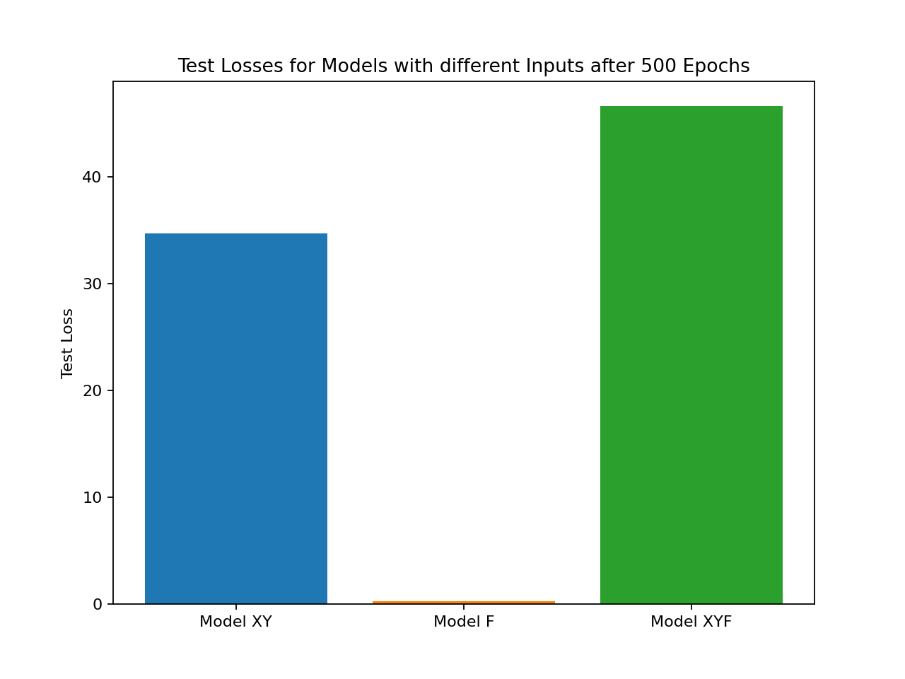
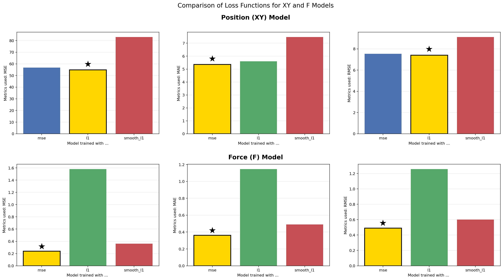
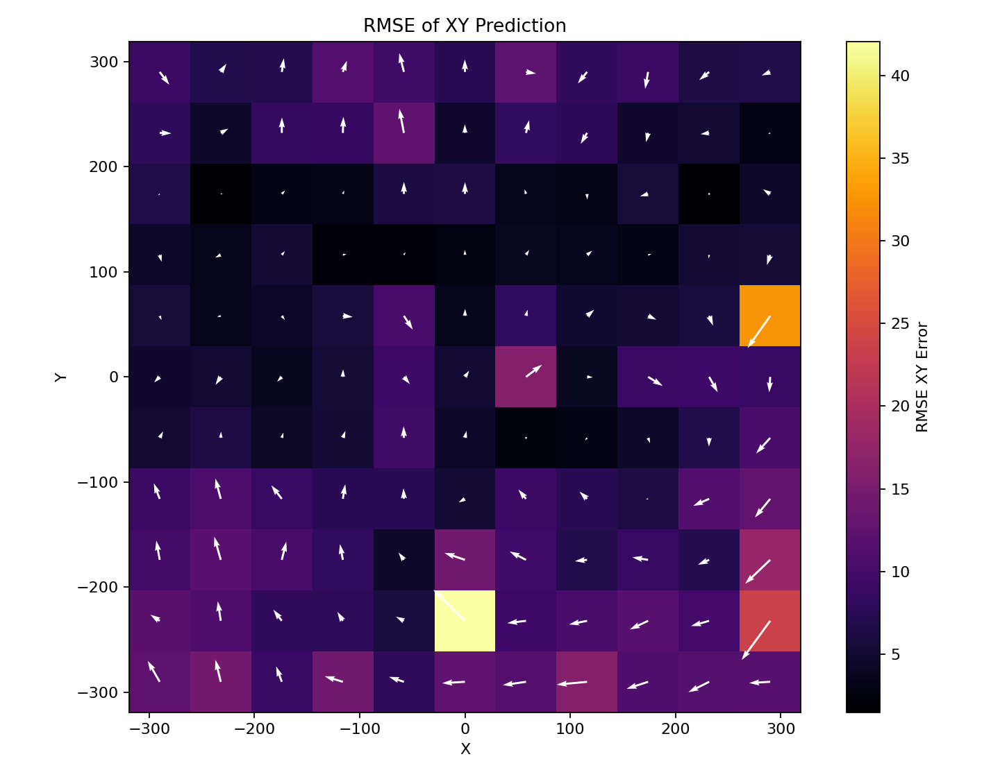
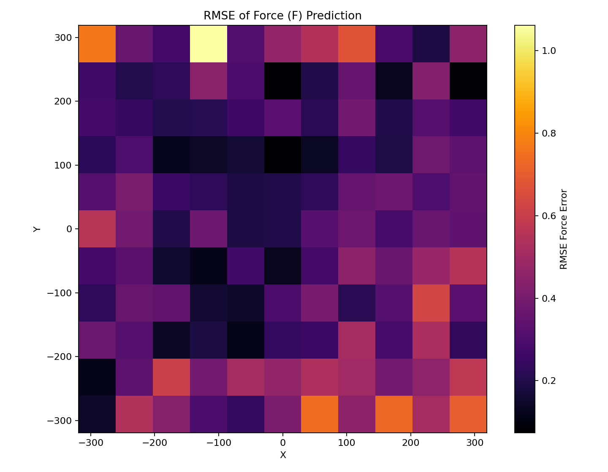

# MeMo – Interactive Membrane Load Detection Demonstrator

This project provides a Python-based GUI for visualizing the real-time load position on a membrane.
A Raspberry Pi reads sensor values via Adafruit ADS1115 ADC converters.
A pre-trained AI model predicts the current load position and displays it in an interactive plot.oad position on the membrane depending on the current sensor values and shows these in a plot. The project also contains the scripts for recording the training data and training the AI model.

## Contact Persons GUI / Demonstrator
- Le Xuan, Hung (SMA) -> Project information
- Koppelmann, Karl (SMA) -> Project information, design demonstrator
- Ngo, Phuong Ngoc -> Project information
- Schmidt, Florian (SMA) -> Software Raspberry, GUI
- Baehr, Thomas (SMA) -> Circuits, Electronics
- Le Xuan, Anh (SMA) -> AI Model, Data Processing, Software GUI

## Results form Training the AI Model
### Model Losses for Different Input Variations ([Notebook](src/main/python/model_input_variation.ipynb))
This comparison shows that the force-only model (F) achieves by far the lowest test loss, meaning force prediction is comparatively easy for the neural network.
The XY model has significantly higher loss due to the nonlinear mapping from sensor values to position.
The combined XYF model performs worst, demonstrating that predicting both position and force simultaneously introduces competing objectives that degrade performance.
So we choose to use separate models for position (XY) and force (F) in the final demonstrator.


---

### Different Loss Functions for Position and Force Prediction ([Notebook](src/main/python/model_lossfn_variation.ipynb))
This set of bar charts compares how different loss functions (MSE, MAE/L1, Smooth L1) influence model performance.
For the position (XY) model, L1 provides the best error metrics, indicating robustness against outliers.
For the force (F) model, MSE performs best, showing that squared penalization is beneficial for smooth regression of force values.
Smooth L1 performs moderately for both models but does not outperform the best individual loss.

<p align="center">
    
</p>



---

### RMSE Heatmap of XY Position Prediction ([Notebook](src/main/python/model_heatmap_errors.ipynb))
This heatmap visualizes the spatial RMSE of the predicted position (x,y).
- colors:
  - Darker regions (black/purple) indicate lower error, meaning the AI predicts the touch position very accurately at these points.
  - Brighter regions (yellow/orange) represent higher error, meaning the prediction deviates more from the true location.
  - For example, a value of 40 on the colorbar corresponds to approximately 6 mm of positional error, calculated by taking the square root of 40

- vectors:
  - The white arrows illustrate the direction and magnitude of the prediction error:
  - The arrow points toward the direction of the offset between predicted and true position.
  - The arrow length represents how far the prediction is off.

<p align="center">
    
</p>



---
### RMSE Heatmap of Force Prediction ([Notebook](src/main/python/model_heatmap_errors.ipynb))
This heatmap visualizes the spatial Root Mean Squared Error (RMSE) of the predicted force F.
Unlike the position error, the force prediction error is purely scalar, so no directional arrows are shown.
- colors:
  - Darker regions (black/purple) indicate very low force prediction error,
  - Brighter regions (orange/yellow) indicate slightly higher error.

Overall, the error values are very small, typically between 0 and 1, which means the model predicts the applied force with high accuracy across the entire membrane.

<p align="center">
  
</p>



## Try it Yourself
### Prerequisites
```bash
# Clone the repository
git clone https://github.com/anh-lxn/memo.git
cd memo

# Create and activate a virtual environment
python -m venv src/venv
source src/venv/bin/activate   # (Linux/macOS)
# .\src\venv\Scripts\activate  # (Windows)

# Install required dependencies
pip install -r src/requirements.txt
```